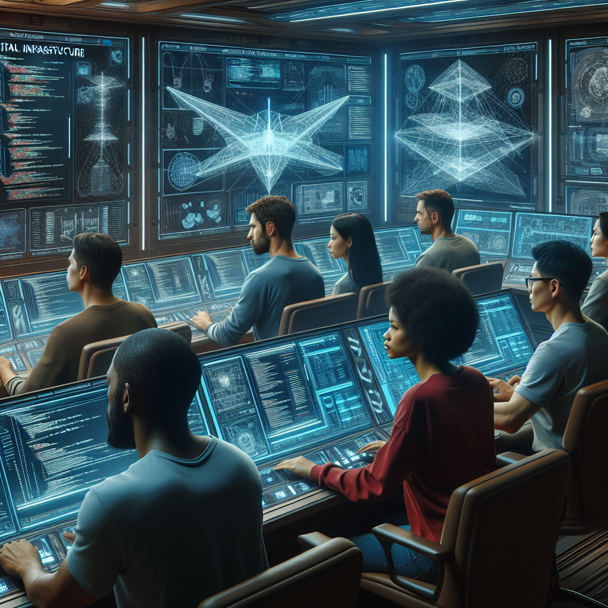

# Challenge 02 - Connection established.

[Previous Challenge >](Challenge-01.md) - [Home](../README.md) - [Next Challenge >](Challenge-03.md)

## Introduction

Your mission, should you choose to accept it, involves the foundational step in building our interstellar infrastructure: creating a Virtual Network (VNet) that will serve as the backbone of our space station's digital ecosystem. As you embark on this mission, keep in mind that the Virtual Network you create today will be the foundation upon which all future tasks will build. Your attention to detail and precision in this initial deployment will ensure a smooth journey through the vast expanse of Azure's digital universe.

  

## Description

- Begin by setting up a Virtual Network (VNet) that will be the core of your future infrastructure. This VNet is akin to the space station's central command hub, ensuring seamless communication and resource management across all systems. Remember, every Azure VNet must include at least one subnet, which will serve as the dedicated channels for various space modules.
- While configuring your VNet, you might think of potentially overlapping IP address ranges within the shared environment. Fear not, as these networks are isolated from one another, much like separate modules on a space station.

## Success Criteria

- Each member of your team has a Virtual Network provisioned to their resource group.
- You have defined at least one subnet for your Virtual Network.
- The code is available on GitHub.

## Learning Resources

- [Create Azure Virtual Network and Subnet with Terraform](https://registry.terraform.io/providers/hashicorp/azurerm/latest/docs/resources/subnet)

[Previous Challenge >](Challenge-01.md) - [Home](../README.md) - [Next Challenge >](Challenge-03.md)
